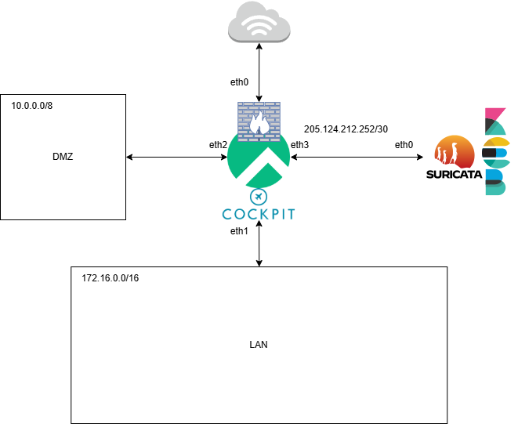

# Documentación de Seguridad en Redes y Sistemas

## Tabla de Contenidos
1. [Configuración de dispositivos de seguridad perimetral](#configuracion-de-dispositivos-de-seguridad-perimetral)
   1.1. [Esquema de red](#esquema-de-red)
   1.2. [Configuración de firewall](#configuracion-de-firewall)
2. [Detección de errores de configuración mediante análisis de tráfico](#deteccion-de-errores-de-configuracion-mediante-analisis-de-trafico)
3. [Identificación de comportamientos no deseados en la red a través del análisis de logs](#identificacion-de-comportamientos-no-deseados-en-la-red-a-traves-del-analisis-de-logs)
4. [Implementación de contramedidas frente a comportamientos no deseados](#implementacion-de-contramedidas-frente-a-comportamientos-no-deseados)
5. [Caracterización, instalación y configuración de herramientas de monitorización](#caracterizacion-instalacion-y-configuracion-de-herramientas-de-monitorizacion)

---

## Configuración de dispositivos de seguridad perimetral

### Esquema de red


El esquema consta de un Rocky Linux 9.5 como router usando Iptables como firewall y cockpit para el sistema de monitoreo, tendra una DMZ en la subred 10.0.0.0/8 para los servicios que se van a exponer al exterior, una LAN en la subred 172.16.0.0/16 y por separado estara suricata en la red 205.124.212.252/30 que va a monitorizar todo el trafico que entre a la red con elasticsearch, kibana y filebeats para la recoleccion de logs
### Configuración de firewall
```bash
#!/bin/bash
# Preguntan al ususario las interfaces
read -p "Pon la interfaz WAN: " WAN
read -p "Pon la interfaz LAN: " LAN
read -p "IP del IPS: " IPS

# Limpiar todas las reglas de iptables
iptables -F
iptables -X
iptables -Z
iptables -t nat -F

# Establecer por defecto aceptar todo el trafico
iptables -P INPUT ACCEPT
iptables -P OUTPUT ACCEPT
iptables -P FORWARD ACCEPT
iptables -t nat -P PREROUTING ACCEPT
iptables -t nat -P POSTROUTING ACCEPT
# Permitir todo el trafico en localhost
iptables -A INPUT -i lo -j ACCEPT
# Habilitar el reenvio de paquetes
echo 1 > /proc/sys/net/ipv4/ip_forward
# Configurar el NAT para que la red local pueda acceder a internet
iptables -t nat -A POSTROUTING -o $WAN -j MASQUERADE
# Permitir conexiones establecidas
iptables -A FORWARD -i $WAN -o $LAN -m state --state RELATED,ESTABLISHED -j ACCEPT
iptables -A FORWARD -i $LAN -o $WAN -j ACCEPT
# Configura el reenvío del puerto 2222 al puerto SSH
iptables -A INPUT -p tcp --dport 2222 -j ACCEPT
iptables -t nat -A PREROUTING -p tcp --dport 2222 -j DNAT --to-destination $IPS:22
# Agregar reglas específicas para permitir conexiones SSH al IPS
iptables -A FORWARD -p tcp -d $IPS --dport 22 -m state --state NEW,ESTABLISHED,RELATED -j ACCEPT
iptables -A FORWARD -p tcp -s $IPS --sport 22 -m state --state ESTABLISHED -j ACCEPT
# Enviar copias de todo el tráfico al IPS
iptables -t mangle -A PREROUTING -j TEE --gateway $IPS
iptables -t mangle -A POSTROUTING -j TEE --gateway $IPS
```

## Detección de errores de configuración mediante análisis de tráfico
<!-- Métodos y herramientas para identificar errores de configuración analizando el tráfico de red. -->

## Identificación de comportamientos no deseados en la red a través del análisis de logs

### Instalacion de Suricata Elasticsearch Kibana Filebeat
```bash
sudo dnf install 'dnf-command(copr)'
sudo dnf copr enable @oisf/suricata-7.0
sudo dnf install epel-release
sudo dnf install suricata
sudo systemctl enable suricata.service
sudo systemctl stop suricata.service
sudo vim /etc/suricata/suricata.yaml
# community-id: true
ip -p -j route show default
sudo vim /etc/suricata/suricata.yaml
# - interface: eth0
# detect-engine:
#  - rule-reload: true
sudo kill -usr2 $(pidof suricata)
sudo suricata-update
sudo suricata-update list-sources
sudo suricata-update enable-source tgreen/hunting
sudo suricata -T -c /etc/suricata/suricata.yaml -v
sudo systemctl start suricata.service
```

```bash
sudo rpm --import https://artifacts.elastic.co/GPG-KEY-elasticsearch
sudo vim /etc/yum.repos.d/elasticsearch.repo
# [elasticsearch]
#name=Elasticsearch repository for 7.x packages
#baseurl=https://artifacts.elastic.co/packages/7.x/yum
#gpgcheck=1
#gpgkey=https://artifacts.elastic.co/GPG-KEY-elasticsearch
#enabled=0
#autorefresh=1
#type=rpm-md
sudo dnf install --enablerepo=elasticsearch elasticsearch kibana
ip -brief address show
sudo vim /etc/elasticsearch/elasticsearch.yml
# network.bind_host: ["127.0.0.1", "205.124.212.254"]
# discovery.type: single-node
# xpack.security.enabled: true
sudo systemctl start elasticsearch.service
cd /usr/share/elasticsearch/bin
sudo ./elasticsearch-setup-passwords auto
cd /usr/share/kibana/bin/
sudo ./kibana-encryption-keys generate -q --force
sudo vim /etc/kibana/kibana.yml
# xpack.encryptedSavedObjects.encryptionKey: 
# xpack.reporting.encryptionKey: 
# xpack.security.encryptionKey: 
# server.host: "205.124.212.254"
cd /usr/share/kibana/bin
sudo ./kibana-keystore add elasticsearch.username
sudo ./kibana-keystore add elasticsearch.password
sudo systemctl start kibana.service
sudo dnf install --enablerepo=elasticsearch filebeat
sudo vim /etc/filebeat/filebeat.yml
# host: "205.124.212.254:5601"
# hosts: ["205.124.212.254:9200"]
# username: "elastic"
# password: "************"
sudo filebeat modules enable suricata
sudo filebeat setup
sudo systemctl start filebeat.service
```

<!-- Procedimientos para analizar logs y detectar actividades sospechosas o no deseadas. -->

## Implementación de contramedidas frente a comportamientos no deseados
<!-- Estrategias y técnicas para mitigar comportamientos no deseados en la red. -->

## Caracterización, instalación y configuración de herramientas de monitorización
### Instalacion de Cockpit
#### Base Debian
```bash
echo "deb http://deb.debian.org/debian ${VERSION_CODENAME}-backports main" > \
    /etc/apt/sources.list.d/backports.list
apt update

apt install -t ${VERSION_CODENAME}-backports cockpit -y
```

#### Base Ubuntu
```bash
sudo apt install -t ${VERSION_CODENAME}-backports cockpit
```

#### Base RHEL

```bash
sudo dnf install cockpit
sudo systemctl enable --now cockpit.socket
```

#### Base Arch

```bash
sudo pacman -S cockpit
sudo systemctl enable --now cockpit.socket
```

Acceder a `https://$ip:9090/`