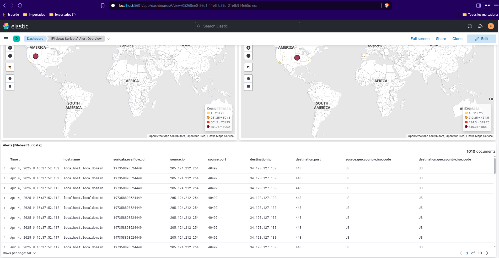
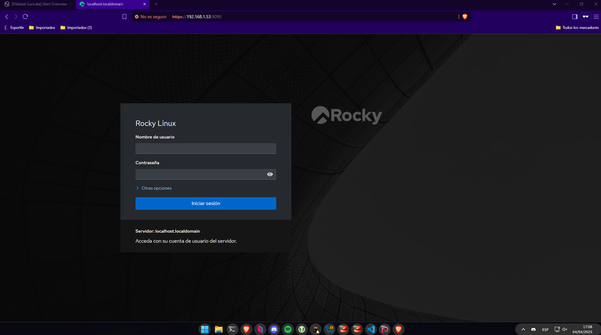

# Documentación de Seguridad en Redes y Sistemas

## Tabla de Contenidos
1. [Configuración de dispositivos de seguridad perimetral](#configuracion-de-dispositivos-de-seguridad-perimetral)
   1.1. [Esquema de red](#esquema-de-red)
   1.2. [Configuración de firewall](#configuracion-de-firewall)
2. [Detección de errores de configuración mediante análisis de tráfico](#deteccion-de-errores-de-configuracion-mediante-analisis-de-trafico)
3. [Identificación de comportamientos no deseados en la red a través del análisis de logs](#identificacion-de-comportamientos-no-deseados-en-la-red-a-traves-del-analisis-de-logs)
4. [Implementación de contramedidas frente a comportamientos no deseados](#implementacion-de-contramedidas-frente-a-comportamientos-no-deseados)
5. [Caracterización, instalación y configuración de herramientas de monitorización](#caracterizacion-instalacion-y-configuracion-de-herramientas-de-monitorizacion)

---

## Configuración de dispositivos de seguridad perimetral

### Esquema de red


El esquema consta de un Rocky Linux 9.5 como router usando Iptables como firewall y cockpit para el sistema de monitoreo, tendra una DMZ en la subred 10.0.0.0/8 para los servicios que se van a exponer al exterior, una LAN en la subred 172.16.0.0/16 y por separado estara suricata en la red 205.124.212.252/30 que va a monitorizar todo el trafico que entre a la red con elasticsearch, kibana y filebeats para la recoleccion de logs
### Configuración de firewall
```bash
#!/bin/bash
# Preguntan al ususario las interfaces
read -p "Pon la interfaz WAN: " WAN
read -p "Pon la interfaz LAN: " LAN
read -p "IP del IPS: " IPS

# Limpiar todas las reglas de iptables
iptables -F
iptables -X
iptables -Z
iptables -t nat -F

# Establecer por defecto aceptar todo el trafico
iptables -P INPUT ACCEPT
iptables -P OUTPUT ACCEPT
iptables -P FORWARD ACCEPT
iptables -t nat -P PREROUTING ACCEPT
iptables -t nat -P POSTROUTING ACCEPT
# Permitir todo el trafico en localhost
iptables -A INPUT -i lo -j ACCEPT
# Habilitar el reenvio de paquetes
echo 1 > /proc/sys/net/ipv4/ip_forward
# Configurar el NAT para que la red local pueda acceder a internet
iptables -t nat -A POSTROUTING -o $WAN -j MASQUERADE
# Permitir conexiones establecidas
iptables -A FORWARD -i $WAN -o $LAN -m state --state RELATED,ESTABLISHED -j ACCEPT
iptables -A FORWARD -i $LAN -o $WAN -j ACCEPT
# Configura el reenvío del puerto 2222 al puerto SSH
iptables -A INPUT -p tcp --dport 2222 -j ACCEPT
iptables -t nat -A PREROUTING -p tcp --dport 2222 -j DNAT --to-destination $IPS:22
# Agregar reglas específicas para permitir conexiones SSH al IPS
iptables -A FORWARD -p tcp -d $IPS --dport 22 -m state --state NEW,ESTABLISHED,RELATED -j ACCEPT
iptables -A FORWARD -p tcp -s $IPS --sport 22 -m state --state ESTABLISHED -j ACCEPT
# Enviar copias de todo el tráfico al IPS
iptables -t mangle -A PREROUTING -j TEE --gateway $IPS
iptables -t mangle -A POSTROUTING -j TEE --gateway $IPS
```


---

## Detección de errores de configuración mediante análisis de tráfico

Aqui hay un ejemplo del trafico recibido cuando nos hacen un nmap

```bash
tshark -r nmapscan.pcapng
    1 0.000000000 192.168.1.34 → 192.168.1.255 UDP 77 48327 → 15600 Len=35
    2 0.610194103  192.168.1.1 → 224.0.0.1    IGMPv2 60 Membership Query, general
    3 5.441153169 PCSSystemtec_8c:67:88 → PCSSystemtec_6f:d3:39 ARP 60 Who has 10.0.0.2? Tell 10.0.0.1
    4 5.441168315 PCSSystemtec_6f:d3:39 → PCSSystemtec_8c:67:88 ARP 42 10.0.0.2 is at 08:00:27:6f:d3:39
    5 6.003756594 192.168.1.34 → 192.168.1.255 UDP 77 51778 → 15600 Len=35
    6 10.627386529  192.168.1.1 → 224.0.0.1    IGMPv2 60 Membership Query, general
    7 12.007930330 192.168.1.34 → 192.168.1.255 UDP 77 59346 → 15600 Len=35
    8 18.011670724 192.168.1.34 → 192.168.1.255 UDP 77 43355 → 15600 Len=35
    9 19.017891369 192.168.1.49 → 192.168.1.255 UDP 86 57621 → 57621 Len=44
   10 20.643079752  192.168.1.1 → 224.0.0.1    IGMPv2 60 Membership Query, general
   11 24.015730759 192.168.1.34 → 192.168.1.255 UDP 77 35110 → 15600 Len=35
   12 30.019390868 192.168.1.34 → 192.168.1.255 UDP 77 58224 → 15600 Len=35
   13 30.658976074  192.168.1.1 → 224.0.0.1    IGMPv2 60 Membership Query, general
   14 35.002821842 192.168.1.49 → 192.168.1.53 TCP 60 52090 → 9090 [SYN] Seq=0 Win=1024 Len=0 MSS=1460
   15 35.003107375 192.168.1.49 → 192.168.1.53 TCP 60 52090 → 22 [SYN] Seq=0 Win=1024 Len=0 MSS=1460
   16 35.003108458 192.168.1.49 → 192.168.1.53 TCP 60 52090 → 2222 [SYN] Seq=0 Win=1024 Len=0 MSS=1460
   17 35.003271609 192.168.1.53 → 192.168.1.49 TCP 60 9090 → 52090 [SYN, ACK] Seq=0 Ack=1 Win=32120 Len=0 MSS=1460
   18 35.003560216 192.168.1.53 → 192.168.1.49 TCP 60 22 → 52090 [SYN, ACK] Seq=0 Ack=1 Win=32120 Len=0 MSS=1460
   19 35.003869547 192.168.1.49 → 205.124.212.254 TCP 60 52090 → 22 [SYN] Seq=0 Win=1024 Len=0 MSS=1460
   20 35.004455521 192.168.1.49 → 192.168.1.53 TCP 60 52090 → 9090 [RST] Seq=1 Win=0 Len=0
   21 35.004455681 192.168.1.49 → 192.168.1.53 TCP 60 52090 → 22 [RST] Seq=1 Win=0 Len=0
   22 35.004455741 205.124.212.254 → 192.168.1.49 TCP 60 22 → 52090 [SYN, ACK] Seq=0 Ack=1 Win=32120 Len=0 MSS=1460
   23 35.004655745 205.124.212.254 → 192.168.1.49 TCP 60 [TCP Retransmission] 22 → 52090 [SYN, ACK] Seq=0 Ack=1 Win=32120 Len=0 MSS=1460
   24 35.005235415 192.168.1.49 → 192.168.1.53 TCP 60 52090 → 2222 [RST] Seq=1 Win=0 Len=0
   25 35.005235575 192.168.1.49 → 205.124.212.254 TCP 60 52090 → 22 [RST] Seq=1 Win=0 Len=0
   26 36.023209150 192.168.1.34 → 192.168.1.255 UDP 77 54886 → 15600 Len=35
   27 40.674641690  192.168.1.1 → 224.0.0.1    IGMPv2 60 Membership Query, general
   28 42.027100889 192.168.1.34 → 192.168.1.255 UDP 77 44578 → 15600 Len=35
```

## Identificación de comportamientos no deseados en la red a través del análisis de logs


### Instalacion de Suricata Elasticsearch Kibana Filebeat
```bash
sudo dnf install 'dnf-command(copr)'
sudo dnf copr enable @oisf/suricata-7.0
sudo dnf install epel-release
sudo dnf install suricata
sudo systemctl enable suricata.service
sudo systemctl stop suricata.service
sudo vim /etc/suricata/suricata.yaml
# community-id: true
ip -p -j route show default
sudo vim /etc/suricata/suricata.yaml
# - interface: eth0
# detect-engine:
#  - rule-reload: true
sudo kill -usr2 $(pidof suricata)
sudo suricata-update
sudo suricata-update list-sources
sudo suricata-update enable-source tgreen/hunting
sudo suricata -T -c /etc/suricata/suricata.yaml -v
sudo systemctl start suricata.service
```

```bash
sudo rpm --import https://artifacts.elastic.co/GPG-KEY-elasticsearch
sudo vim /etc/yum.repos.d/elasticsearch.repo
# [elasticsearch]
#name=Elasticsearch repository for 7.x packages
#baseurl=https://artifacts.elastic.co/packages/7.x/yum
#gpgcheck=1
#gpgkey=https://artifacts.elastic.co/GPG-KEY-elasticsearch
#enabled=0
#autorefresh=1
#type=rpm-md
sudo dnf install --enablerepo=elasticsearch elasticsearch kibana
ip -brief address show
sudo vim /etc/elasticsearch/elasticsearch.yml
# network.bind_host: ["127.0.0.1", "205.124.212.254"]
# discovery.type: single-node
# xpack.security.enabled: true
sudo systemctl start elasticsearch.service
cd /usr/share/elasticsearch/bin
sudo ./elasticsearch-setup-passwords auto
cd /usr/share/kibana/bin/
sudo ./kibana-encryption-keys generate -q --force
sudo vim /etc/kibana/kibana.yml
# xpack.encryptedSavedObjects.encryptionKey: 
# xpack.reporting.encryptionKey: 
# xpack.security.encryptionKey: 
# server.host: "205.124.212.254"
cd /usr/share/kibana/bin
sudo ./kibana-keystore add elasticsearch.username
sudo ./kibana-keystore add elasticsearch.password
sudo systemctl start kibana.service
sudo dnf install --enablerepo=elasticsearch filebeat
sudo vim /etc/filebeat/filebeat.yml
# host: "205.124.212.254:5601"
# hosts: ["205.124.212.254:9200"]
# username: "elastic"
# password: "************"
sudo filebeat modules enable suricata
sudo filebeat setup
sudo systemctl start filebeat.service
```




## Implementación de contramedidas frente a comportamientos no deseados

Bloquear ips de paises

Vamos a `https://www.ip2location.com/free/visitor-blocker`

Descargamos las ip de un pais para iptables

Lo descomprimimos 
```bash
gzip -d firewall.txt.gz
```

Cambiamos la extension de `txt` a `sh` y le ponemos `#!/bin/bash` al principio del fichero

le damos permisos y lo ejecutamos
```bash
chmod +x firewall.sh && ./firewall.sh
```


Reglas para detectar escaneos de nmap

```bash
cd /etc/suricata/rules/
wget https://raw.githubusercontent.com/aleksibovellan/opnsense-suricata-nmaps/refs/heads/main/local.rules
```

Evitar escaneos con portspoof

```bash
git clone https://github.com/drk1wi/portspoof

cd portspoof

./configure

make

sudo make install

iptables -t nat -A PREROUTING -i eth0 -p tcp -m tcp --dport 1:65535 -j REDIRECT --to-ports 4444

portspoof -c /etc/portspoof.conf -s /etc/portspoof_signatures -D

portspoof -D

```

## Caracterización, instalación y configuración de herramientas de monitorización
### Instalacion de Cockpit
#### Base Debian
```bash
echo "deb http://deb.debian.org/debian ${VERSION_CODENAME}-backports main" > \
    /etc/apt/sources.list.d/backports.list
apt update

apt install -t ${VERSION_CODENAME}-backports cockpit -y
```

#### Base Ubuntu
```bash
sudo apt install -t ${VERSION_CODENAME}-backports cockpit
```

#### Base RHEL

```bash
sudo dnf install cockpit
sudo systemctl enable --now cockpit.socket
```

#### Base Arch

```bash
sudo pacman -S cockpit
sudo systemctl enable --now cockpit.socket
```

Acceder a `https://$ip:9090/`



----


----


---


----

### Ventajas y desventajas

#### Nagios

##### Ventajas de Cockpit:

1. Interfaz web moderna y más intuitiva
2. Instalación y configuración mucho más sencilla
3. Menor curva de aprendizaje
4. Integración nativa con sistemas Linux
5. Acceso directo a la terminal del sistema
6. Gestión de contenedores Docker/Podman integrada
7. No requiere agentes adicionales

##### Desventajas de Cockpit:

1. Capacidades de monitorización más limitadas
2. Menos opciones de alertas y notificaciones
3. No está diseñado específicamente para monitorización de redes
4. Escalabilidad limitada para grandes infraestructuras
5. Menos plugins y extensiones disponibles
6. Menos capacidades de informes y análisis históricos

#### Zabbix

##### Ventajas de Cockpit:

1. Instalación mucho más sencilla y rápida
2. Interfaz más moderna y minimalista
3. Mejor para administración directa de servidores
4. Menos recursos de sistema requeridos
5. Acceso a terminal web integrado
6. Gestión directa de servicios systemd

##### Desventajas de Cockpit:

1. No es una solución completa de monitorización
2. Sin monitorización distribuida avanzada
3. Menos capacidades de descubrimiento automático
4. Funcionalidades limitadas para monitorización de aplicaciones
5. Sin plantillas predefinidas para monitorización
6. Carece de monitorización proactiva avanzada

#### TheHive

##### Ventajas de Cockpit:

1. Enfocado en administración de sistemas
2. Más liviano y directo
3. Mejor para tareas administrativas cotidianas
4. Integración nativa con servicios de Linux
5. Visualización de métricas en tiempo real

##### Desventajas de Cockpit:

1. No está diseñado para gestión de incidentes de seguridad
2. Sin capacidades de respuesta a incidentes
3. No integra análisis de amenazas
4. Sin gestión de casos ni flujos de trabajo
5. No es una plataforma SOAR (Security Orchestration, Automation, Response)
6. No se integra con feeds de inteligencia de amenazas