# Documentacion de GLPI

## Tabla de Contenidos

1. [Instalación](#instalación)
2. [Crear una nueva cola de tickets](#crear-una-nueva-cola-de-tickets)
3. [Abrir una incidencia](#abrir-un-incidencia)
4. [Resolverla con otro usuario](#resolverla-con-otro-usuario)
5. [Registrar un item en el inventario](#registrar-un-item-en-el-inventario)

----------

## Instalación

```bash
git clone https://github.com/jmlcas/glpi
cd glpi
docker-compose up -d
docker inspect -f '{{range .NetworkSettings.Networks}}{{.IPAddress}}{{end}}' #ContainerID
```

Elegimos Español (España)

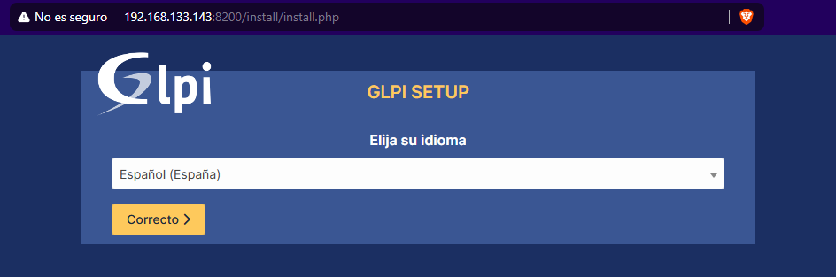

Aceptamos la licencia

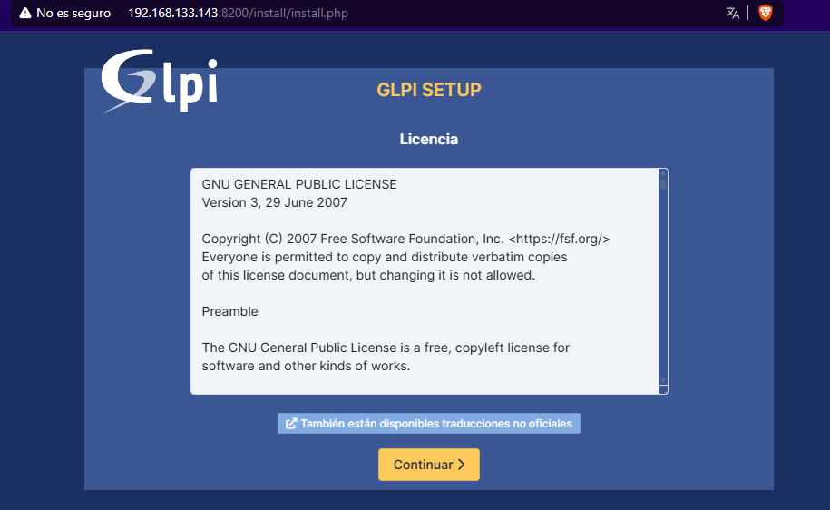

Le damos a instalar

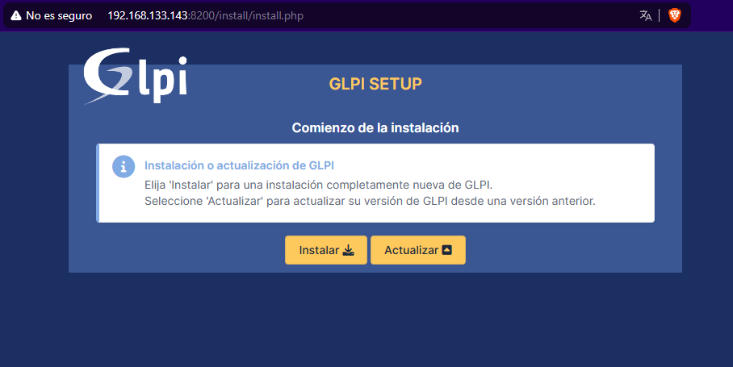

Le damos a continiuar

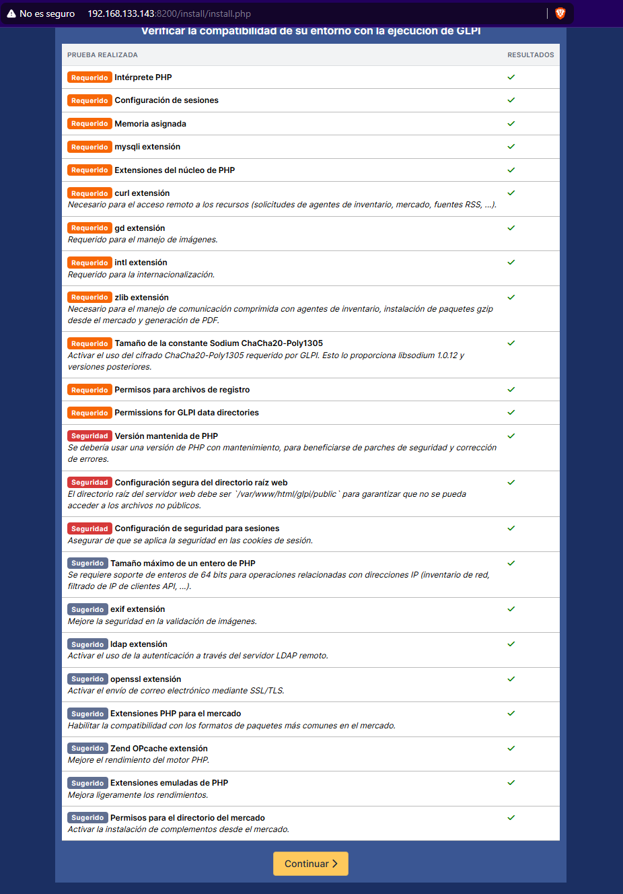

Nos pedira la ip, el usuario y contraseña de la base de datos que obtenemos al ver el archivo `mariadb.env`

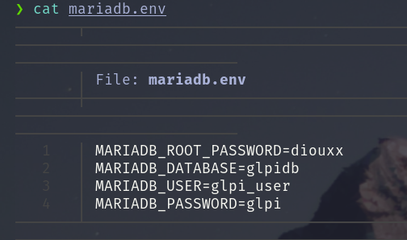

Nos conectaremos a la base de datos y la seleccionamos

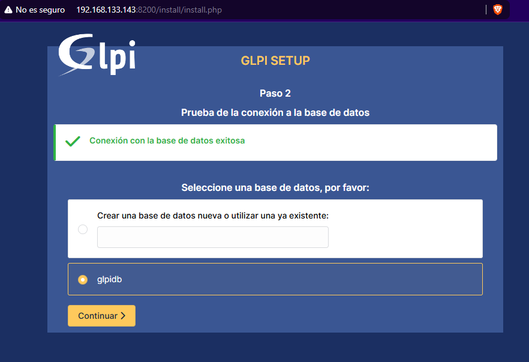

Le damos a continuar

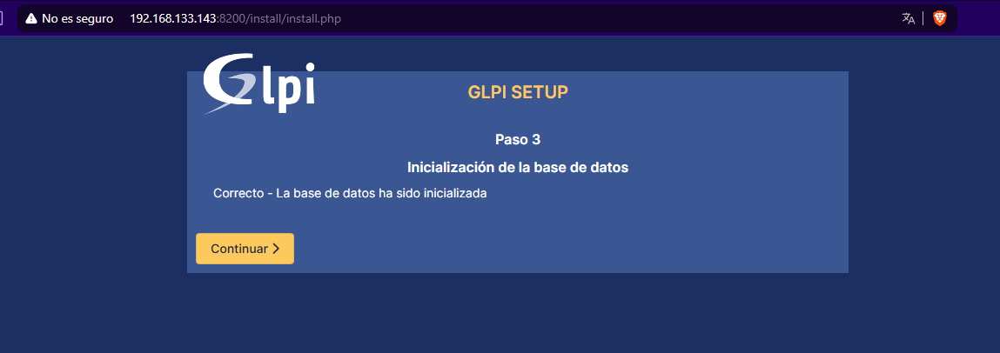

No enviamos estadisticas de uso

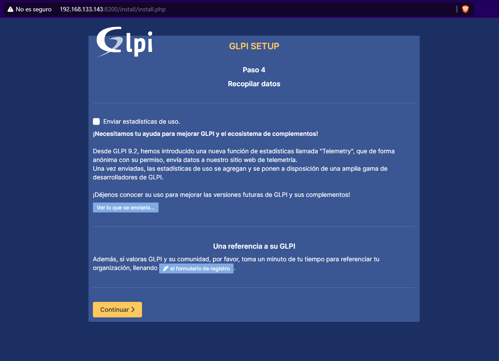

Le damos a continuar

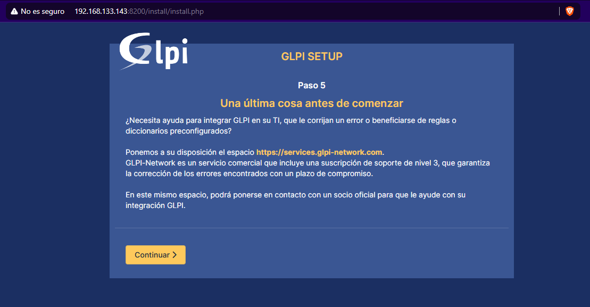

Acabamos dandole a Utilizar GLPI

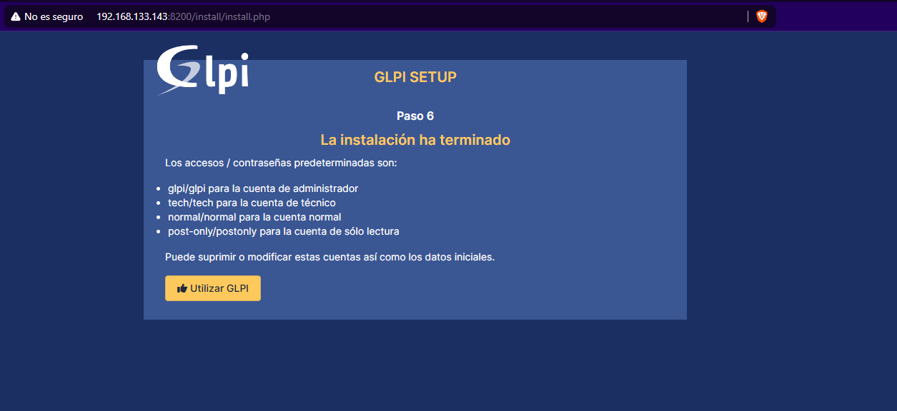

Acedemos a GLPI

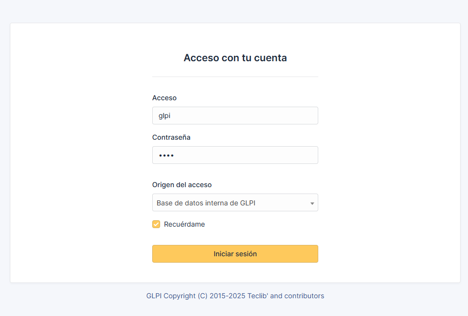


-----------


## Crear una nueva cola de tickets

En Administración/Entidades le damos a Añadir

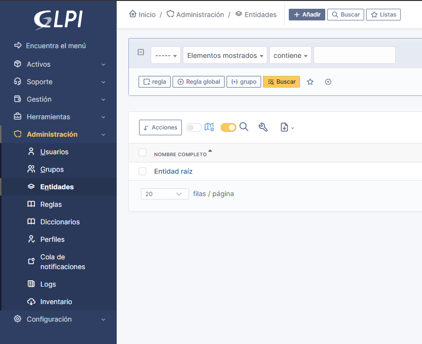

Nos pedira un nombre y comentarios y ya lo tenemos creado

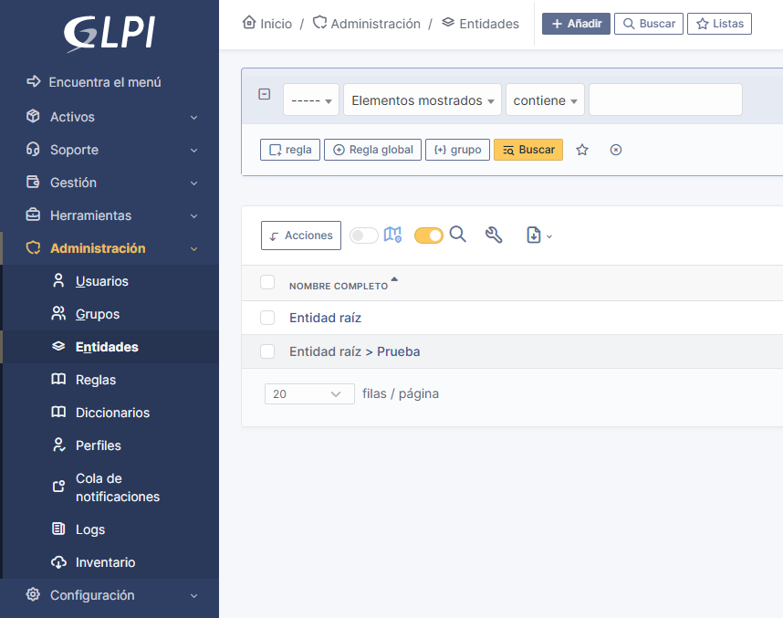

---------------

## Abrir un incidencia

Vamos a Soporte/Peticiones y creamos una incidencia con los datos necesarios

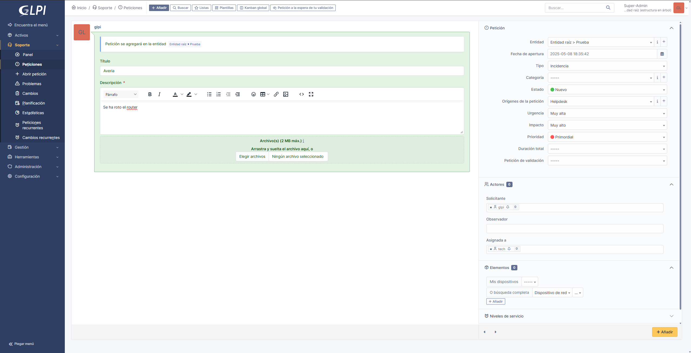

Luego lo editamos para asignarlo a otro usuario

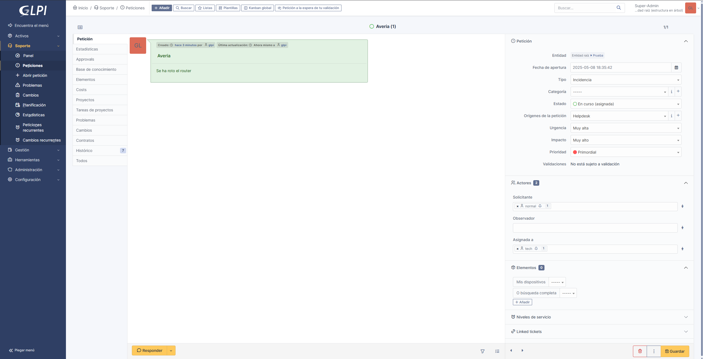


-----------


## Resolverla con otro usuario

Entramos como Tech y mandamos una peticion de que esta solucionado
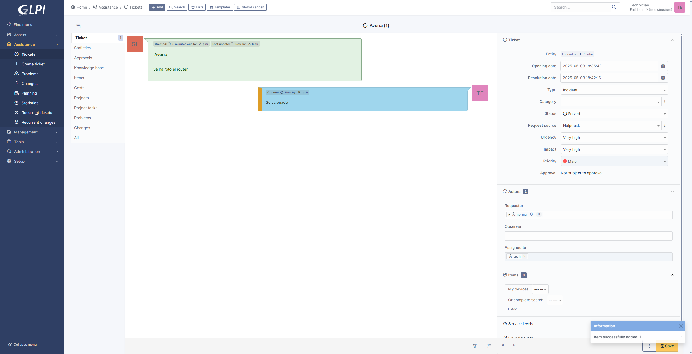

Desde el administrador aceptamos la peticion

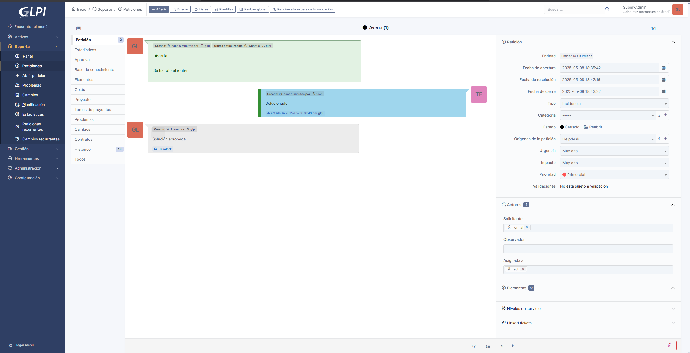


---------


## Registrar un item en el inventario

Vamos a activos y por ejemplo en Software añadimos los campos necesarios
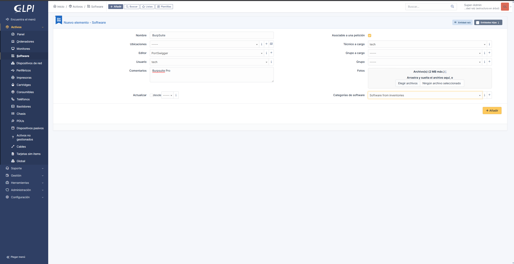

**Autor: Xavier Quintero Carrejo**